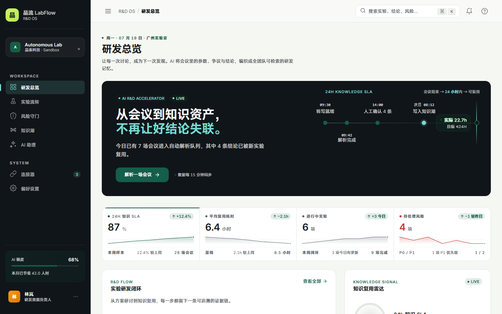
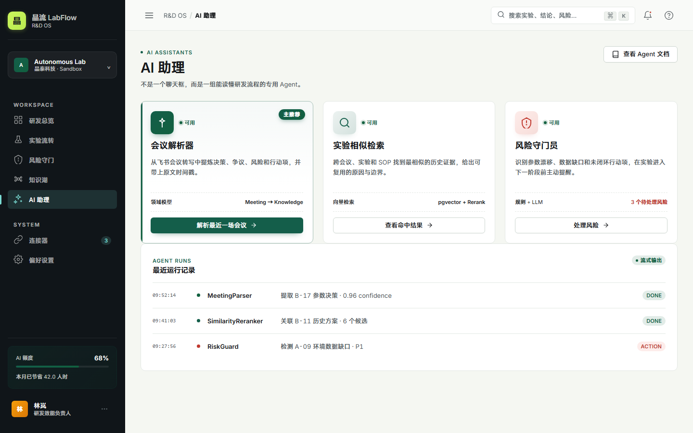
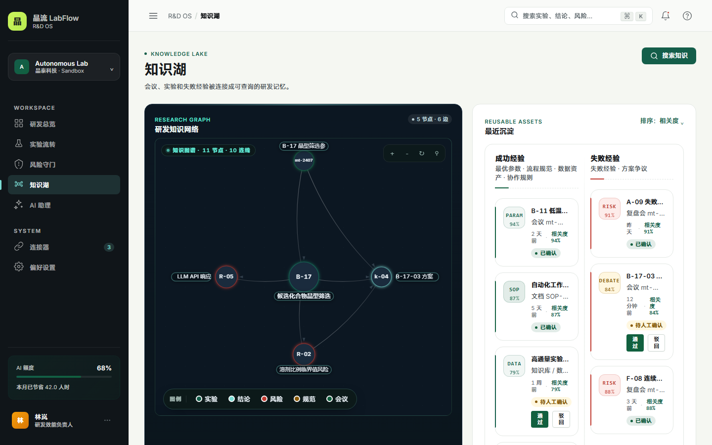
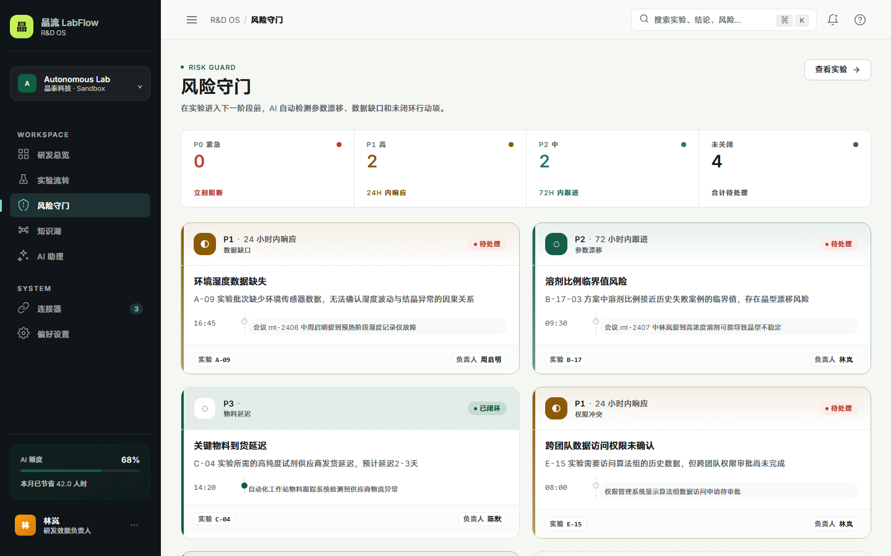
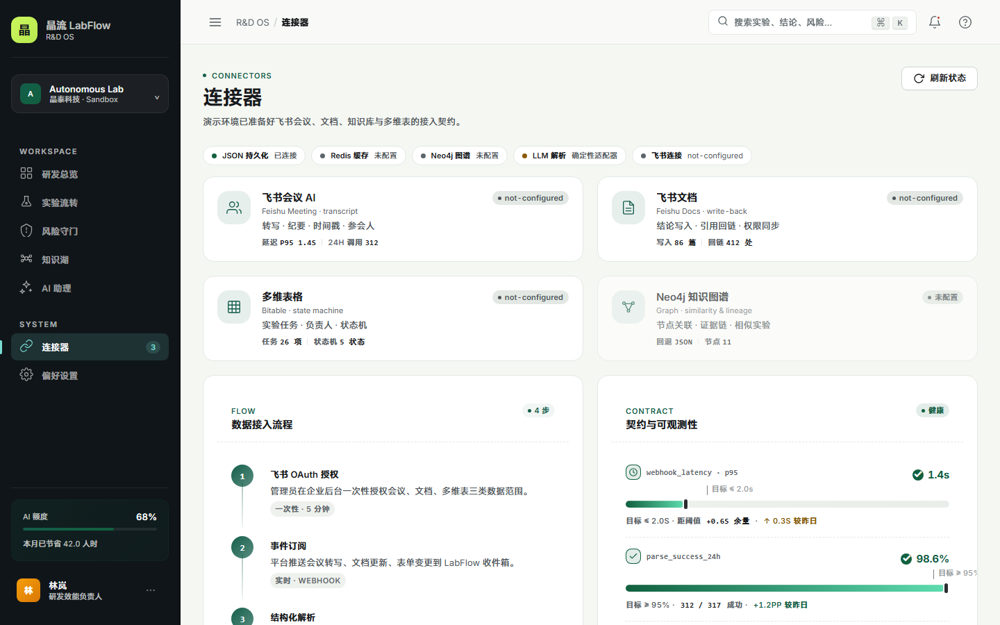
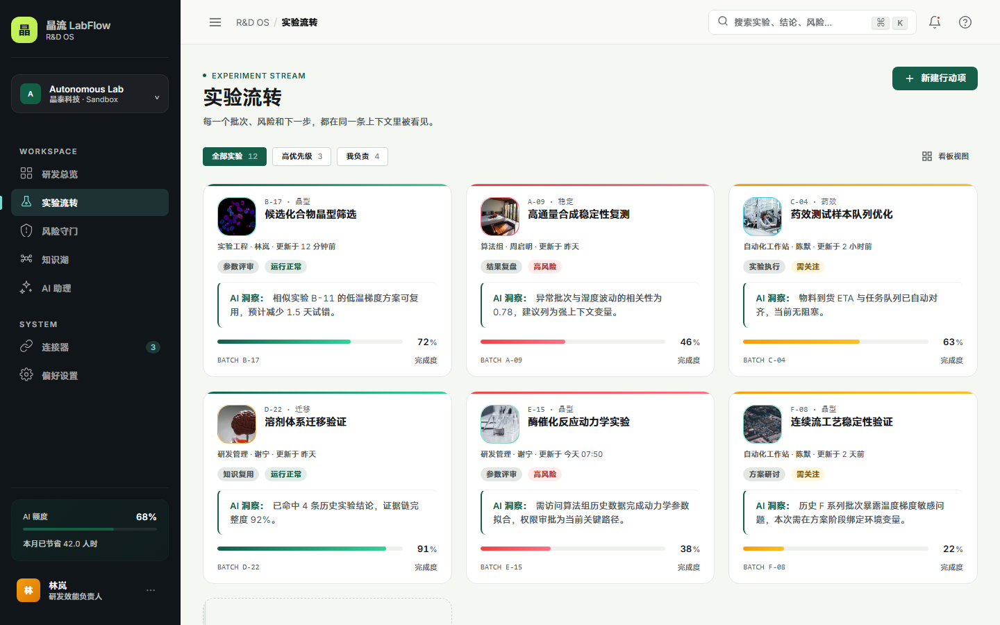
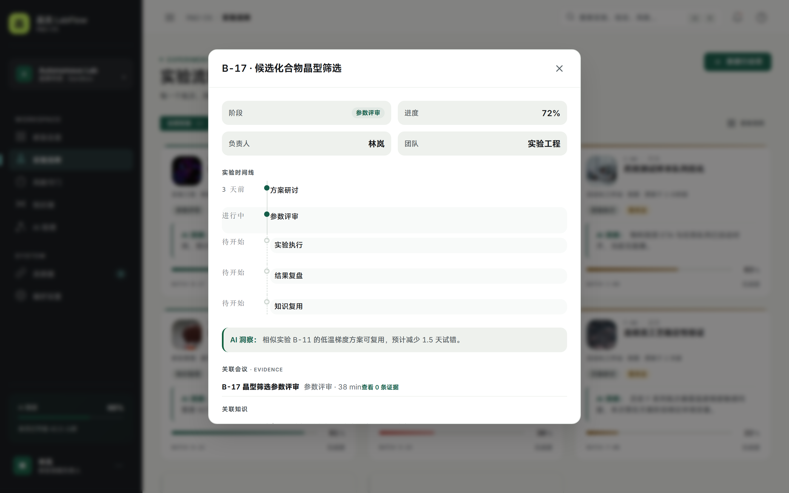
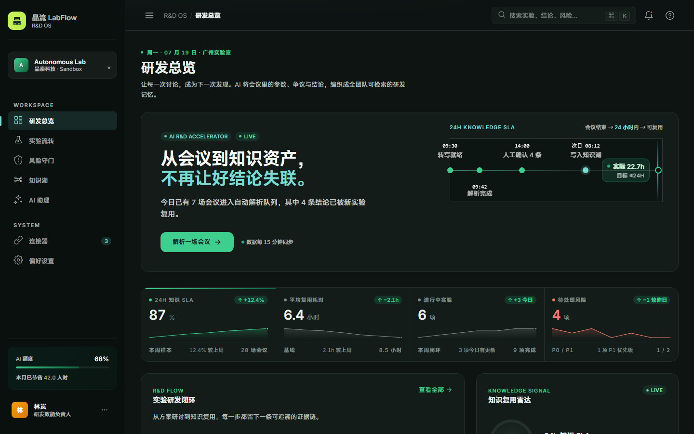
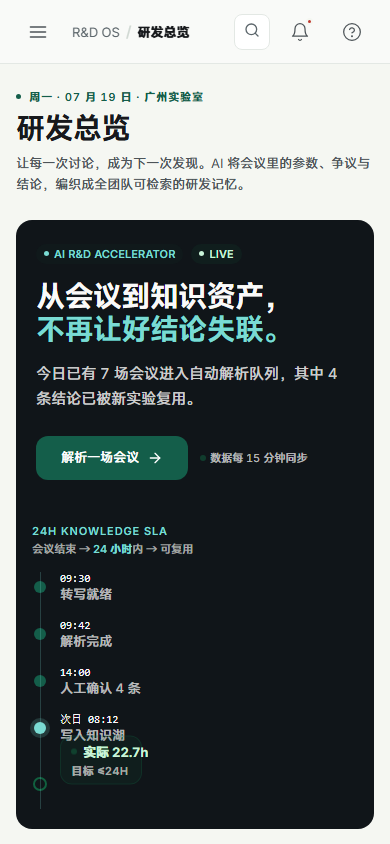
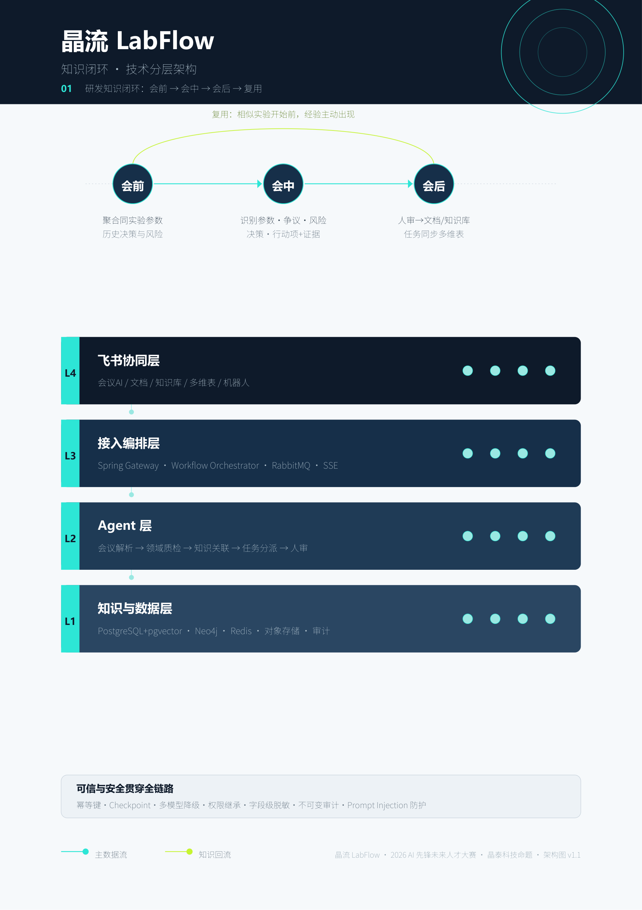

<div align="center">


# 晶流 LabFlow · AI 实验研发加速器
### Autonomous Lab AI R&D Accelerator

**让一次讨论，在 24 小时内成为下一次实验的起点。**

---

[](https://handlermapping-labflow-demo.ms.show/)
[](https://nodejs.org/)
[](#-系统架构设计)
[](#-核心技术栈)
[](https://playwright.dev/)
[](LICENSE)

[🖥️ 系统演示](#-产品视觉展示) · [🏗️ 架构设计](#-系统架构设计) · [⚡ 核心功能](#-核心功能亮点) · [🚀 快速开始](#-快速开始与本地运行)

</div>

<details>
<summary><b>📑 目录（点击展开）</b></summary>

- [📖 项目简介](#-项目简介)
- [🖼️ 产品视觉展示](#-产品视觉展示)
- [✨ 核心功能亮点](#-核心功能亮点)
- [🏗️ 系统架构设计](#-系统架构设计)
- [🛠️ 核心技术栈](#-核心技术栈)
- [🚀 在线 Demo 与部署](#-在线-demo-与部署)
- [🚀 快速开始与本地运行](#-快速开始与本地运行)
- [📁 项目目录结构](#-项目目录结构)
- [🪢 飞书真实集成](#-飞书真实集成可选--配置后自动启用)
- [🛡️ 可信 AI 与安全设计](#-可信-ai-与安全设计)
- [❓ 常见问题 FAQ](#-常见问题-faq)
- [📄 开源许可证](#-开源许可证)

</details>

---

## 📖 项目简介

在智能自主实验室中，真正昂贵的不是单次会议或单次实验，而是**同一个问题被第二次讨论、同一个失败错误被第二次重复**。传统研讨会后，关键实验参数、争议焦点与避坑策略散落在转写文本、个人文档与临时表格中，导致研发经验无法围绕“实验对象”高效流动与沉淀。

**晶流 LabFlow** 是专为高频实验研发团队打造的 **AI 上下文操作系统**。系统以“实验编号”为主线，贯穿「方案研讨 — 参数评审 — 实验执行 — 结果复盘 — 经验复用」全生命周期。通过提出 **24h 知识 SLA** 指标，确保会议结束 24 小时内，经过确认的关键决策均附带秒级原文证据时间戳，写入研发知识图谱，并在下一次相似实验开启前自动进行**风险拦截预警**。

---

## 🖼️ 产品视觉展示

### 🖥️ 研发总览看板 (R&D Dashboard)
> 实时监控 24h 知识 SLA 达标率、累计节省研发人时及多阶段实验闭环图谱。
<div align="center">
  
</div>

<br />

<table width="100%">
  <tr>
    <td width="50%" align="center">
      <b>💬 AI 会议结构化解析器 (SSE 流式)</b><br />
      <small>多 Agent 流水线实时可视，提炼决策并带秒级证据时间戳</small><br /><br />
      
    </td>
    <td width="50%" align="center">
      <b>🕸️ 动态研发知识图谱 (Canvas)</b><br />
      <small>力导向布局 + 拖拽交互 + 悬停高亮关联</small><br /><br />
      
    </td>
  </tr>
</table>

<br />

<table width="100%">
  <tr>
    <td width="50%" align="center">
      <b>🛡️ 风险守门员面板 (Risk Guard)</b><br />
      <small>P0-P3 分级、AI 建议、触发参数与一键关闭</small><br /><br />
      
    </td>
    <td width="50%" align="center">
      <b>🤖 AI 助理工作台 (Agents)</b><br />
      <small>三大专用 Agent 协同：解析、检索、守门</small><br /><br />
      
    </td>
    <td width="50%" align="center">
      <b>🔌 连接器真实状态 (Integrations)</b><br />
      <small>基础设施 / 飞书契约状态实时探测，诚实降级</small><br /><br />
      
    </td>
  </tr>
</table>

<br />

<table width="100%">
  <tr>
    <td width="50%" align="center">
      <b>🔄 实验流转看板 (Experiments)</b><br />
      <small>五阶段实验闭环流转 · 新建实验前置风险校验</small><br /><br />
      
    </td>
    <td width="50%" align="center">
      <b>🔬 实验详情弹窗 (Experiment Detail)</b><br />
      <small>5 阶段时间线 · 关联会议 / 知识 / 风险一屏尽览</small><br /><br />
      
    </td>
  </tr>
</table>

<br />

<table width="100%">
  <tr>
    <td width="50%" align="center">
      <b>🌙 深色主题 (Dark Theme)</b><br />
      <small>科研暗色 · 全站令牌统一</small><br /><br />
      
    </td>
  </tr>
</table>

<br />

<div align="center">
  <b>📱 移动端响应式工作台 (Mobile Workbench)</b><br />
  <small>适配移动端体验，方便实验室现场随时查阅风控预警与实验流转</small><br /><br />
  
</div>

---

🎬 **系统演示视频**：[▶️ 点击在线播放《晶流 LabFlow 系统演示》](output/晶流LabFlow-系统演示视频.mp4)（1920×1080 · 实际时长约 2 分 18 秒 · 2026-08-12 更新，覆盖当前 UI 全部主链路）

---

## ✨ 核心功能亮点

- ⚡ **24h 知识 SLA 闭环**：设定可量化的研发效能指标，会议结束 24 小时内自动提炼结构化知识单元并完成团队沉淀。
- 🎯 **带证据时间戳的结构化解析**：基于 Structured Output 识别方案决策、核心参数调整与技术风险，**每一条结论附带精确到秒的原文转写时间戳与置信度**，拒绝生成不可追溯的正确废话。
- 🔄 **任务自动分派与多维表闭环**：自动提取会议行动项（Action Items），智能分派负责人与截止时间，无缝同步至飞书多维表格与待办中心。
- 🛡️ **失败经验标准化建模与风险守门员**：将历史失败案例按 `触发参数 — 异常症状 — 可能根因 — 规避策略` 单独建模，下一次相似实验启动前主动触发风险警报。
- 🔍 **图谱 + 向量混合检索 (Hybrid RAG)**：结合 `pgvector` 语义召回与 `Neo4j` 知识图谱推演，兼顾参数重叠度、实验阶段与证据溯源。

### 🆕 v0.2 新增功能（40 强赛版）

- 🌊 **SSE 流式解析体验**：AI 会议解析器升级为 Server-Sent Events 流式输出，实时可视多 Agent 流水线执行过程（MeetingParser → QualityCheck → GraphLinker → Orchestrator），增强用户对 AI 决策的信任感。
- 🕸️ **Canvas 动态知识图谱**：基于原生 Canvas 实现的力导向布局图，支持节点拖拽、悬停高亮关联边、点击查看详情弹窗，27 个节点 23 条关系边（由数据自动推导），深色科技风格渲染。
- 🛡️ **风险守门员独立面板**：P0-P3 风险分级看板，5 条风险数据覆盖数据缺口、参数漂移、权限冲突、物料延迟、模型降级场景，支持风险详情弹窗与一键标记已处理。
- 📋 **实验详情弹窗**：点击实验卡片弹出详情，展示 5 阶段时间线、关联会议、关联知识资产、关联风险，形成完整的实验上下文视图。
- ✨ **微交互动画**：卡片悬停浮起、按钮点击缩放、页面切换淡入、进度条填充动画等细节打磨。

---

## 🏗️ 系统架构设计



> **当前复赛版（实测）：** Node.js 原生 HTTP 零依赖后端（统一 envelope + SSE 流式 + 审计 + SLA）→ 多 Agent 流水线（MeetingParser → QualityCheck → GraphLinker → RiskGuard）→ Human-in-the-Loop 审批 → JSON seed+runtime 持久化（Redis / Neo4j / LLM / 飞书均为**契约就绪或诚实降级**，不伪造真实接入）。
>
> 可编辑源文件：`output/architecture.html`；完整 API 契约见 `API_DOCUMENTATION.md`。

---

## 🛠️ 核心技术栈

| 层级 | 当前复赛版（实测） | 生产迁移方向 |
| :--- | :--- | :--- |
| **前端展现** | 原生 HTML5 / CSS3 / ES Modules（无框架无构建 · 设计令牌 · 深浅主题 · 移动端 390px） | React / Vue + TypeScript |
| **后端 API** | Node.js 原生 http（零第三方运行时依赖）· 统一 envelope · SSE · 审计 · SLA | Spring Boot 模块化 |
| **Agent 编排** | 确定性适配器 + OpenAI-compatible 接口（未配置时诚实降级 demo-adapter） | DeepSeek-V3 / Doubao-Pro / Spring AI |
| **数据存储** | JSON seed + runtime（事实数据源）· Redis / Neo4j 可选且诚实降级 | PostgreSQL + pgvector / Neo4j / Redis |
| **测试与媒体** | Playwright (v1.61) / FFmpeg / SAPI TTS | 同左（可挂 CI） |

---

## 🚀 在线 Demo 与部署

- **在线 Demo**：https://handlermapping-labflow-demo.ms.show/ （公网 HTTPS，可手机/桌面直接访问）
- **一键部署配置**：`render.yaml` + `Dockerfile`（Node 22 Alpine，零第三方运行时依赖）；如当前实例需启用后端接口，见 `DEPLOYMENT.md` 重新部署
- 详细步骤：见 `DEPLOYMENT.md`

## 🚀 快速开始与本地运行

### 环境要求
* **Node.js**: `>= 20.0`
* **PowerShell** (Windows 环境推荐)

### 1. 初始化环境
在项目根目录运行初始化脚本（自动自检并校验环境变量）：
```powershell
.\setup.ps1
```

### 2. 启动本地服务
运行语法静态检查并启动开发服务器：
```powershell
npm run check
npm start
```
启动成功后，在浏览器访问：**`http://localhost:4173`** 即可体验完整的交互功能。

### 3. 常用 REST API
```text
GET  /api/health                  # 服务健康度检查
GET  /api/overview                # 研发总览与看板指标获取（含风险数据）
GET  /api/experiments             # 实验流转列表查询
POST /api/experiments             # 新建实验（含风险前置校验：参数越界 422、相似实验/失败经验 warnings）
GET  /api/experiments/:id         # 实验详情（含时间线、关联会议、关联知识、关联风险）
GET  /api/knowledge               # 知识资产列表（支持 ?status= 过滤）
GET  /api/risks                   # 风险列表查询（支持 P0-P3 分级）
GET  /api/infra/status            # 各组件真实连接状态（json/redis/neo4j/llm/feishu）
GET  /api/meetings/:id            # 会议详情 + 解析状态 + 关联实验/风险
GET  /api/meetings/:id/evidence   # 会议证据片段列表（精确到秒的原文时间戳）
GET  /api/graph                   # 知识图谱节点/边（支持 ?experimentId= 过滤）
GET  /api/audit                   # 审计记录（任务/风险/知识审批/会议解析，支持 ?entityId=）
GET  /api/metrics/sla             # 24h 知识 SLA 指标（达标率、平均时长、按日分布）
POST /api/meetings/:id/analyze    # 触发 AI 会议结构化解析（即时响应）
POST /api/meetings/:id/analyze-stream  # SSE 流式解析（实时推送 Agent 执行过程，幂等/断线恢复）
POST /api/risks/:id/resolve       # 标记风险为已处理
POST /api/knowledge/:id/approve   # 知识审批：通过并进入知识湖
POST /api/knowledge/:id/reject    # 知识审批：驳回（body 可带 reason）
POST /api/search                  # 研发知识湖统一语义搜索
POST /api/tasks                   # 创建新行动项任务
PUT  /api/tasks/:id               # 更新标题、负责人、截止时间或状态
DELETE /api/tasks/:id             # 删除任务并写入活动日志
OPTIONS /api/*                    # CORS 预检
```

> 除健康检查与 SSE 外，所有 JSON API 统一返回 `{ data, meta: { requestId, mode, generatedAt }, error }` envelope；出错时 `error` 为 `{ code, message }`，HTTP 状态码保持语义。详细契约见 `API_DOCUMENTATION.md`。

### 4. Docker 一键演示环境

项目提供独立的 `labflow-net` 网络，不会修改其他项目的容器、网络或端口。应用使用 `4173`，Neo4j 映射到 `7475/7688`，Redis 映射到 `6380`；容器内通过 `labflow-neo4j` 与 `labflow-redis` 服务名通信。

```bash
# 可选：复制并填写 LLM_API_KEY；未配置时自动使用脱敏确定性适配器
cp .env.example .env
docker compose up -d --build
# 浏览器打开 http://localhost:4173

docker compose logs -f labflow-app
docker compose down
```

Neo4j Browser 地址为 `http://localhost:7475`，演示账号为 `neo4j`，密码为 compose 文件中的演示密码。Neo4j 与 Redis 为可选基础设施，当前 JSON 适配器仍是默认数据源。`data/runtime.json` 会通过项目目录挂载持久化。

> **演示边界**：当前飞书连接器采用“正式契约 + 脱敏适配器”模式；LLM、飞书 API、Neo4j 与 Redis 均可替换为真实生产服务，但本仓库不包含任何真实企业凭证或企业数据。


### 5. 恢复初始演示数据
在现场演示或测试后，如需还原初始种子数据，请执行：
```powershell
.\scripts\reset-demo.ps1
```

---

## 📁 项目目录结构

```text
晶流LabFlow/
├── server.js              # Node 原生 HTTP 后端入口（统一 envelope · SSE · 审计 · SLA）
├── feishu.js              # 飞书集成层（token 缓存 · 妙记转写 · 多维表格读写 · 消息推送）
├── public/                # 前端静态资源（原生 HTML / CSS / ES Modules，无框架无构建）
│   ├── index.html         # 单页应用入口
│   ├── app.js             # 前端交互逻辑
│   ├── styles.css         # 全站样式与设计令牌（深浅主题）
│   ├── demo-data.js       # 演示静态数据兜底
│   └── assets/            # 图片 / 字体等静态资产
├── data/
│   └── seed.json          # 初始种子数据（实验 / 会议 / 知识 / 风险）
├── scripts/               # 辅助脚本（reset-demo.ps1 数据重置 · 录屏 · 部署校验等）
├── output/                # 截图 / 演示视频 / 架构图等生成产物
├── API_DOCUMENTATION.md   # API 契约文档
├── DEPLOYMENT.md          # 部署指南
└── README.md              # 本文件
```

---

## 🪢 飞书真实集成（可选 · 配置后自动启用）

- 集成层 `feishu.js`（原生 fetch，零第三方依赖）：token 自动缓存/刷新、妙记转写、多维表格读写、消息推送
- 配置 `FEISHU_APP_ID` / `FEISHU_APP_SECRET` 后：
  - 会议解析优先拉取**真实妙记转写**（`mode=feishu-minutes`）
  - 知识审批 / 风险闭环自动写回多维表格 + 推送飞书群（best-effort，结果落审计）
  - 连接器页 `feishu` 状态显示真实 `connected`（不再写死契约占位）
- 未配置时：状态为 `not-configured`，产品保持演示模式，**绝不伪造连接**
- 环境变量见 `.env.example`，凭证一律不进仓库

## 🛡️ 可信 AI 与安全设计

1. **证据强关联 (Evidence Timestamping)**：每条结论强制映射原文时间戳，杜绝生成式 AI 的无根据“幻觉”。
2. **专家二审机制 (Human-in-the-Loop)**：高风险参数调整与置信度低于 `0.85` 的结论需经过专家确认后方可写入正式知识库。
3. **Prompt 注入防护**：转写文本视为不可信输入，工具调用严格限制于白名单与类型校验。
4. **ACL 权限继承**：继承团队既有协同权限，向量与图谱检索自动执行二次过滤。

---

## ❓ 常见问题 FAQ

**Q1：未配置 `LLM_API_KEY`，系统为什么也能跑？**
Agent 编排层内置**脱敏确定性适配器（demo-adapter）**：未配置 LLM 环境变量时自动降级，按确定性规则产出带证据时间戳的结构化结果，保证演示链路完整可复现；配置 OpenAI-compatible 接口后自动切换真实 LLM。连接器页会如实展示当前模式，绝不伪造连接。

**Q2：魔搭在线 Demo 与本地运行有什么差异？**
两者基于同一套代码。在线 Demo（ms.show）免装环境、公网 HTTPS 直接访问，适合快速体验完整交互；本地运行可按需启用 Docker 可选基础设施（Neo4j / Redis）、`.env` 密钥与飞书真实集成，适合深度评审与二次开发。

**Q3：演示或测试后数据改乱了，如何恢复初始演示数据？**
在项目根目录执行 `.\scripts\reset-demo.ps1`，即可将运行时数据还原为初始种子数据，恢复全部实验、会议、知识与风险演示内容。

---

## 📄 开源许可证

本项目基于 [MIT License](LICENSE) 许可协议开源。
