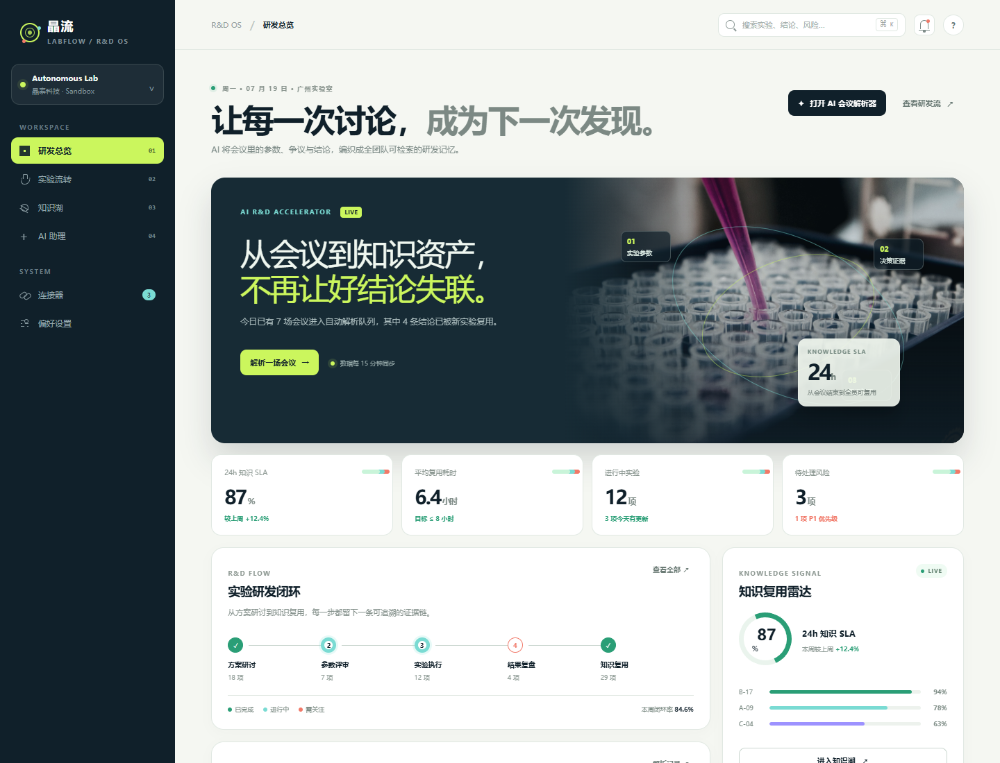
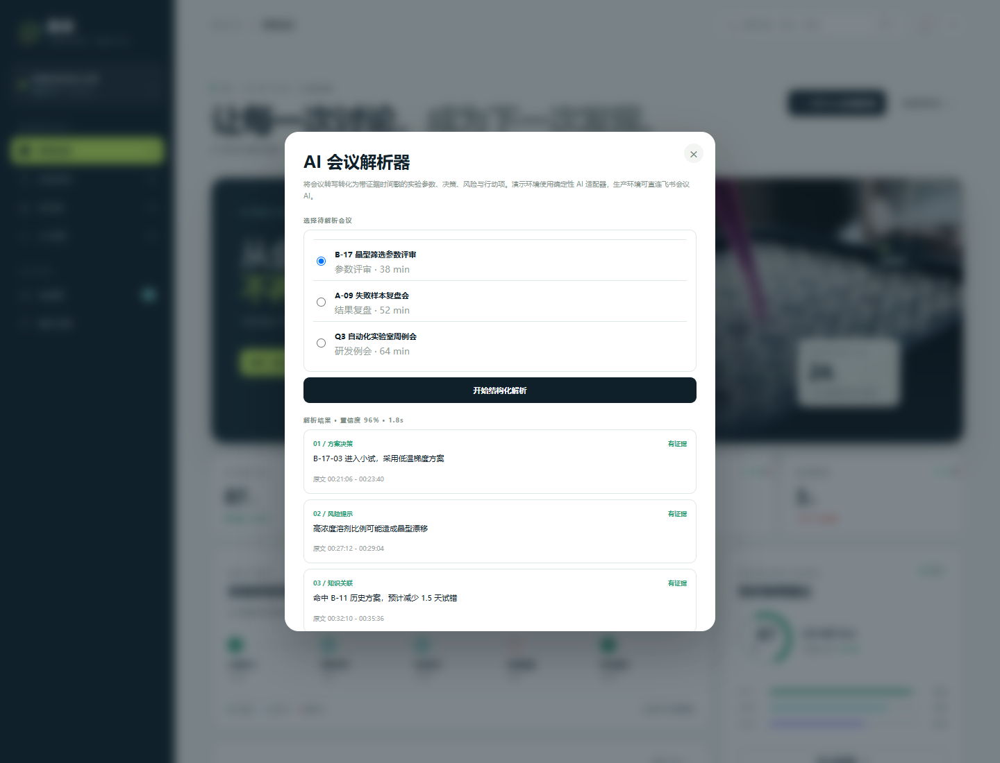
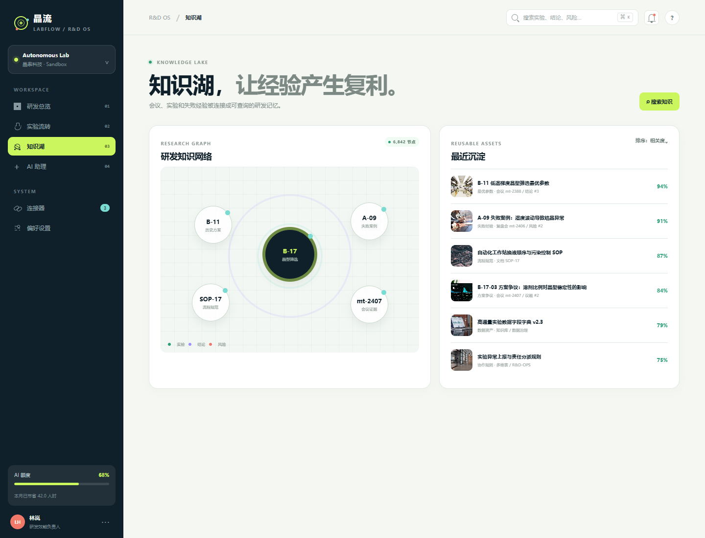
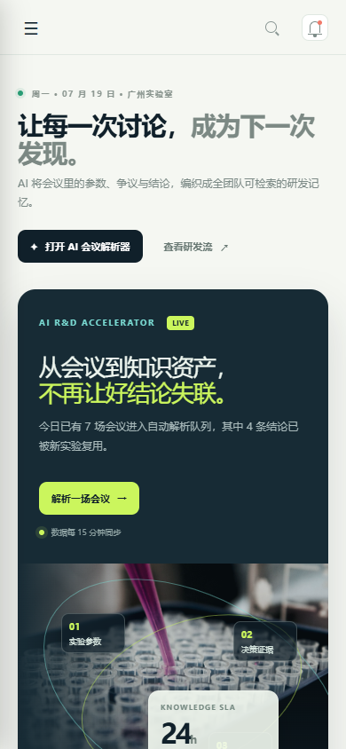
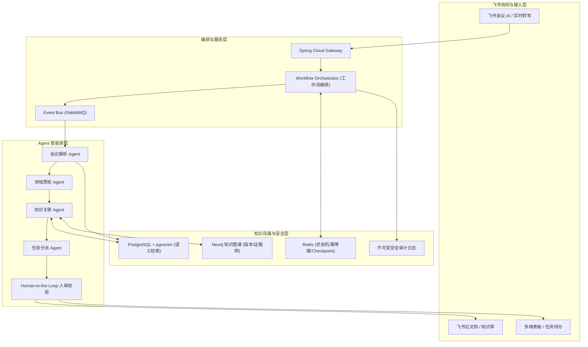

#  晶流 LabFlow ｜ AI 实验研发加速器

<div align="center">

[](https://nodejs.org/)
[](https://playwright.dev/)
[](https://ffmpeg.org/)
[](LICENSE)

**让一次研发讨论，在 24 小时内沉淀为全团队可检索、可理解、可复用的知识资产。**

[📖 产品与技术方案书](docs/03-产品与技术完整方案.md) · [🎬 自动生成的演示视频](output/晶流LabFlow-系统演示视频.mp4) · [📊 报名提报与答辩问答](docs/05-路演脚本与答辩问答.md)

</div>

---

## 🧬 1. 项目定位与核心痛点

在智能自主实验室中，真正昂贵的不是进行一次会议或实验，而是**同一个问题被第二次讨论、同一个错误被第二次犯下**。研发会后的决策结论、敏感实验参数、争议风控点往往零散在会议转写、文档和个人经验中，导致数据链路无法围绕“实验对象”高效流动。

**晶流 LabFlow** 重新定义了会议总结工具。系统以**“实验编号”**为主线，打通「方案研讨—参数评审—实验执行—结果复盘—经验复用」五大生命周期。我们提出了可量化的 **24h 知识 SLA** 指标——确保会议结束 24 小时内，提炼出的关键知识单元均带有原文证据、置信度，能被团队快速索引，并在下一次相似实验开始前**主动预警风控**。

<div align="center">
  
</div>

---

## ✦ 2. 系统核心功能特性

### 📊 研发总览 (R&D Dashboard)
*   **SLA 实时监控**：直观展示 24h 知识 SLA 达标率、累计节省研发人时等核心量化效能指标。
*   **状态闭环追踪**：可视化展示实验研发状态机，通过状态流转关联相应的会议和待办事项。

### 💬 AI 会议结构化解析 (Meeting Intelligence)
*   **结构化提炼**：拒绝冗长的概括，精准识别会议中的**方案决策、技术风险、参数调整**与**知识关联**。
*   **可信证据链**：每一条结论都带有**精确到秒的原文转写时间戳与置信度**，确保 AI 结论百分之百可追溯。
*   **行动项闭环**：智能分派行动负责人与截止日期，一键同步飞书多维表格与待办中心。

<div align="center">
  
</div>

### 🕸️ 以实验为中心的知识湖 (Research Graph)
*   **图谱与向量融合 (Hybrid RAG)**：通过 `pgvector` 进行语义相似方案召回，使用 `Neo4j` 知识图谱对实验版本、前置依赖及权限进行关系推理。
*   **失败经验规避**：对失败模式按「触发参数—症状—可能根因—规避策略」进行标准化建模，下一次相似实验前由“风险守门员”主动发出风险预警。

<div align="center">
  
</div>

### 📱 响应式多端适配
*   **移动工作台**：完美适配手机端（390×844），满足研发人员在实验室现场随时记录、查看数据监查与接收风控预警的移动化场景。

<div align="center">
  
</div>

---

## 🛠️ 3. 系统技术架构

本系统设计了高可靠、企业级安全的安全防线，打通飞书开放平台层至数据存储层：



### 🛡️ 安全与防幻觉设计
1.  **证据硬关联**：所有写入知识库的 AI 结论，必须有原始转写文本作为支撑。
2.  **风控人机协同 (Human-in-the-Loop)**：高风险参数和低置信度（< 0.85）结论必须经过研发专家二审确认后方可入库。
3.  **Prompt 注入防护**：转写文本视为不可信输入，调用工具限制于强校验白名单中。
4.  **安全隔离**：完全继承飞书文档及组织架构权限体系，向量检索依据用户凭证执行二次过滤。

---

## 💻 4. 技术栈列表

| 模块层级 | 选用技术 | 说明 |
| :--- | :--- | :--- |
| **前端展现** | Vanilla HTML5 / CSS3 / ES Modules JS | 零第三方包依赖，纯原生高性能，采用暗黑微拟态科技视觉 |
| **后端编排** | Node.js / Spring Boot & Spring AI | 提供模块化 Web API 与工作流调度控制 |
| **智能体组** | LLM (DeepSeek-V3 / Doubao-Pro) | 负责 Structured Output 解析、Schema 校验与 Reranker |
| **混合存储** | PostgreSQL + pgvector / Neo4j / Redis | 提供语义向量召回、知识图谱关联及分布式锁/幂等去重 |
| **录制与媒体** | Playwright (v1.61) / FFmpeg / Windows SAPI | 驱动无头浏览器执行自动演示流，合成演示视频及旁白 |

---

## 🚀 5. 本地运行与快速开始

### 开发要求
*   **Node.js** >= 20.0
*   **PowerShell** (用于执行环境初始化脚本)

### 步骤一：一键配置环境
在项目根目录下打开 PowerShell 终端，运行：
```powershell
.\setup.ps1
```
*(如果系统限制执行策略，可使用 `powershell -ExecutionPolicy Bypass -File setup.ps1` 启动。脚本会自动创建 `.env` 并执行代码语法自检。)*

### 步骤二：启动服务器
执行以下命令启动本地静态服务与 mock API：
```powershell
npm run check
npm start
```
服务启动后，在浏览器访问：**`http://localhost:4173`** 即可进行交互式功能体验。

### 📚 常用 API 列表
```text
GET  /api/health            # 服务健康度检查
GET  /api/overview          # 研发效能与看板指标获取
GET  /api/experiments       # 获取实验流转明细
GET  /api/knowledge         # 获取最近沉淀知识列表
POST /api/meetings/:id/analyze # 触发飞书会议 AI 结构化提炼
POST /api/search            # 执行混合语义搜索
POST /api/tasks             # 新建闭环行动项
```

---

## 📽️ 6. 自动视频生成管线说明

本仓库包含一个全自动视频生成流水线，开发者可运行下述命令在本地全自动录制并导出系统演示视频：
```powershell
node scripts/generate_video.js
```
**管线工作机制**：
1.  **语音合成**：Node 自动组装 PowerShell 脚本，利用 Windows 语音库（微软 Huihui 中文语音）合成各段演示旁白 WAV 文件，并计算各音频段精确时长。
2.  **浏览器自动化**：Playwright 启动 Chromium，与旁白时长精确同步在页面上模拟点击、解析、拓扑展示、检索和流转等步骤，并将其捕获为 WebM 高清视频轨。
3.  **压制合并**：FFmpeg 将多段旁白合并，并与 WebM 视频轨压制导出为标准的 **[output/晶流LabFlow-系统演示视频.mp4](file:///M:/%E9%A1%B9%E7%9B%AE/%E6%AF%94%E8%B5%9B/AI%E5%85%88%E9%94%8B%E6%9C%AA%E6%9D%A5%E4%BA%BA%E6%89%8D%E5%A4%A7%E8%B5%9B/output/%E6%99%B6%E6%B5%81LabFlow-%E7%B3%BB%E7%BB%9F%E6%BC%94%E7%A4%BA%E8%A7%86%E9%A2%91.mp4)**。

---

## 📄 7. 开源声明与许可

本项目根据 **[MIT License](LICENSE)** 许可协议开源。所有演示数据均为构造/脱敏数据，不包含任何真实商业机密。
