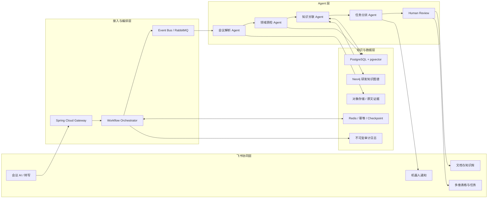
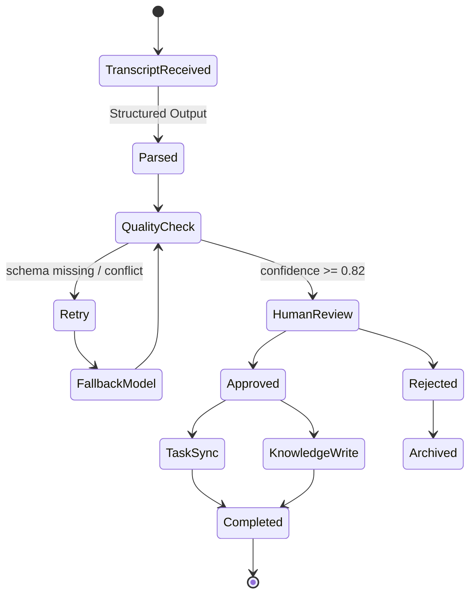
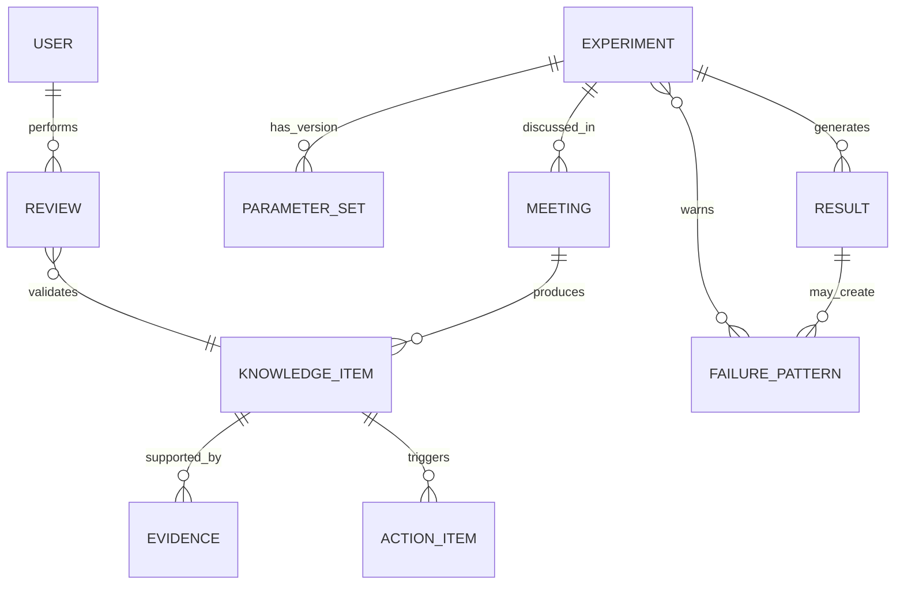

# 03｜产品与技术完整方案

## 1. 产品定位

晶流 LabFlow 不是通用会议助手，而是智能自主实验室的“研发上下文操作系统”。它以实验为主实体，把会议、参数、争议、风险、决策、行动项、结果和知识连接起来。

**North Star Metric：24h 知识 SLA 达标率。**  
定义：研发会议结束后 24 小时内，经过人工确认的关键结论可被有权限的团队成员搜索、理解、引用和回溯。

## 2. 用户旅程

| 阶段 | 用户动作 | AI 动作 | 飞书承载 | 输出 |
|---|---|---|---|---|
| 会前 | 关联实验编号、确认议题 | 聚合历史参数、未关闭风险、相似案例 | 日历/会议、文档、知识库 | 研发上下文包 |
| 会中 | 正常研讨 | 实时识别参数、争议、风险、决策 | 飞书会议 AI | 带时间戳候选结论 |
| 会后 | 负责人审核 | 拆解任务、识别冲突、补齐字段 | 文档、多维表、任务 | 决策记录与行动项 |
| 执行 | 工程师更新实验状态 | 追踪超期、阻塞、数据缺口 | 多维表、机器人 | 实验状态机 |
| 复盘 | 标注成功/失败与边界 | 形成模式、建立证据链 | 知识库 | 可复用知识单元 |
| 复用 | 开启相似实验 | 主动召回并解释适用性 | 搜索/机器人 | 建议与风险预警 |

## 3. 系统架构



### 为什么需要图谱 + 向量，而不是只做 RAG

- 向量检索擅长“文本相似”，但不能稳定回答“该结论适用于哪个实验版本、哪些参数范围、由谁审核”。
- 知识图谱表达强关系、版本、权限和证据；pgvector 提供语义候选；Rerank 结合参数重叠、实验阶段、时间衰减和人审等级排序。
- 最终分数示例：`0.45 × 语义相似 + 0.25 × 参数重叠 + 0.15 × 阶段一致 + 0.10 × 人审等级 + 0.05 × 时间新鲜度`。

## 4. Agent 编排



### 结构化输出 Schema

```json
{
  "meeting_id": "mt-2407",
  "experiment_id": "exp-b17",
  "items": [
    {
      "type": "DECISION",
      "claim": "B-17-03 采用低温梯度方案进入小试",
      "evidence": { "start": "00:21:06", "end": "00:23:40", "speaker": "研发负责人" },
      "parameters": [{ "name": "cooling_gradient", "value": "low", "unit": null }],
      "confidence": 0.96,
      "review_status": "PENDING",
      "applicability": "仅适用于当前溶剂体系 v2"
    }
  ]
}
```

## 5. 核心数据模型



关键字段：

- `KnowledgeItem`：类型、结论、适用边界、置信度、审核状态、版本、权限标签。
- `Evidence`：会议 ID、开始/结束时间、说话人、原文片段、内容哈希。
- `FailurePattern`：触发参数、症状、可能根因、避免策略、验证次数。
- `ActionItem`：负责人、截止、优先级、来源、状态、幂等键。

## 6. 后端服务划分（生产版）

| 服务 | 责任 | 关键技术 |
|---|---|---|
| connector-service | 飞书 Webhook、OAuth、对象同步 | Spring Boot、Feign、签名校验 |
| meeting-ai-service | 转写解析、Structured Output、证据定位 | Spring AI、SSE、多模型降级 |
| workflow-service | 状态机、Checkpoint、重试、人审 | RabbitMQ、Redis、幂等键 |
| experiment-service | 实验、参数、版本、任务 | PostgreSQL、MyBatis-Plus |
| knowledge-service | 图谱写入、向量检索、Rerank | pgvector、Neo4j |
| risk-service | 规则、冲突检测、风险守门 | Drools/规则表 + LLM |
| audit-service | 审计、追踪、指标 | append-only event、OpenTelemetry |

MVP 阶段可先合并为模块化单体，等业务边界稳定后再拆微服务，避免为了比赛过度架构。

## 7. API 契约摘要

| 方法 | 路径 | 说明 |
|---|---|---|
| POST | `/webhooks/feishu/meeting-ended` | 接收会议结束事件，校验签名与去重 |
| POST | `/api/v1/meetings/{id}/extract` | 发起结构化解析，返回任务 ID |
| GET | `/api/v1/jobs/{id}/events` | SSE 查看 Agent 流式进度 |
| POST | `/api/v1/knowledge/{id}/review` | 审核/驳回 AI 结论 |
| POST | `/api/v1/experiments/{id}/transition` | 推进实验状态并检查守门规则 |
| POST | `/api/v1/search` | 混合检索与可解释 Rerank |
| GET | `/api/v1/knowledge/{id}/evidence` | 返回证据与原文回链 |
| GET | `/api/v1/metrics/knowledge-sla` | 统计 24h SLA、复用率和闭环率 |

## 8. 可靠性设计

1. 事件幂等键：`tenant_id + meeting_id + event_type + version`。
2. Outbox Pattern 保证数据库写入与 MQ 事件最终一致。
3. Agent 每阶段落 Checkpoint，失败从最近步骤恢复。
4. 首字节超时和绝对 Deadline；高级模型失败自动切换低成本模型。
5. Structured Output 校验失败进入修复模型，仍失败转人工。
6. 写入飞书对象前校验对象版本，避免覆盖人工编辑。
7. 死信队列保留原始事件与失败原因，可重放。
8. 每个结论带 trace_id，贯穿会议转写、模型调用、审核和知识写入。

## 9. 隐私与安全

- 继承飞书组织、文档和会议权限；检索结果按用户身份二次过滤。
- 原始转写与结构化结论分层存储；默认只索引必要字段。
- 人名、药物代号和实验参数按角色脱敏；模型调用前做字段级策略判断。
- 向量库不得绕过 ACL；每条向量保留 tenant、resource、permission 标签。
- 敏感操作写入不可变审计；支持来源追踪、撤回、删除和重新索引。
- Prompt Injection 防护：会议文本视为不可信数据，不执行其中指令；工具调用使用白名单与参数校验。
- 演示环境使用构造/脱敏数据，不使用任何真实企业内部信息。

## 10. 评测与实验设计

- 由两名标注者独立标注参数、决策、风险、行动项；Cohen's Kappa 检查一致性。
- Extraction：Precision、Recall、F1；Evidence：时间戳 IoU；Assignment：负责人/截止字段准确率。
- Retrieval：Recall@5、nDCG@10、人工采纳率。
- Workflow：端到端延迟、任务闭环率、失败恢复成功率、重复事件幂等率。
- 业务代理指标：重复讨论时长、重复试错次数、24h 知识 SLA。

## 11. 当前验证版与生产版映射

| 当前仓库 | 生产替换 |
|---|---|
| Node 原生 API | Spring Boot 模块化后端 |
| `data/seed.json` | PostgreSQL、Neo4j、pgvector |
| deterministic AI adapter | 飞书会议 AI + Spring AI 多模型 |
| 本地知识搜索 | 混合检索 + Rerank + ACL |
| 页面连接器状态 | 真实 OAuth/Webhook/文档/多维表 API |

当前实现的价值是验证产品闭环、交互路径和后端契约；企业数据与正式账号到位后再替换适配层，避免在未授权条件下伪造真实集成。
